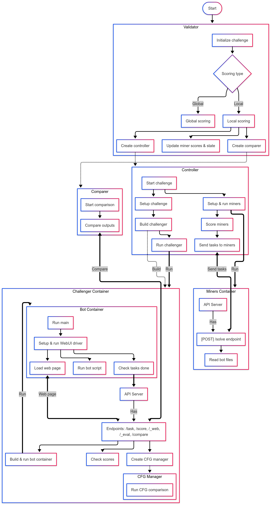
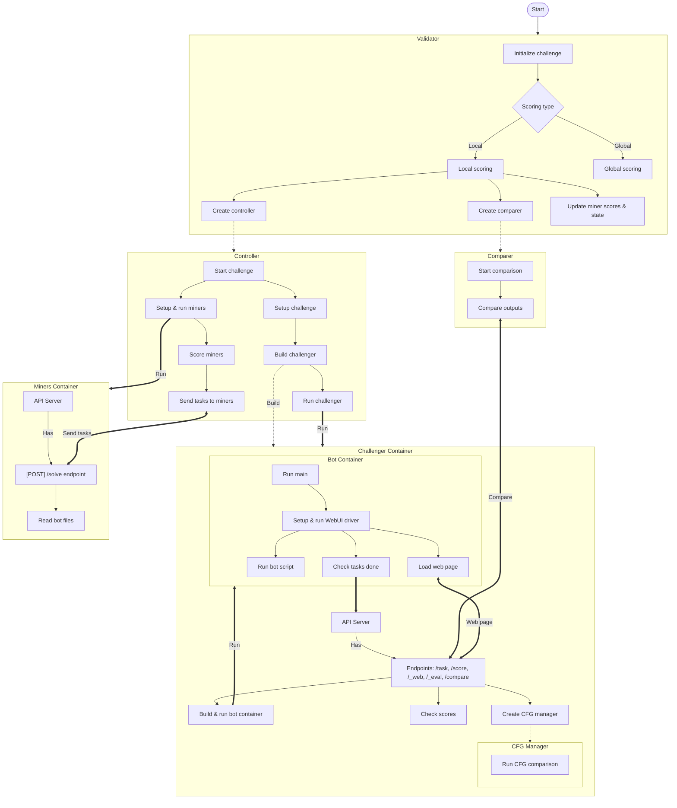

# Humanize behavior challenge (Small)

## Mermaid flowchart

```mermaid
flowchart TD
  subgraph validator["Validator"]
    vl_init["Initialize challenge"]
    vl_scoring{"Scoring type"}
    vl_local["Local scoring"]
    vl_global["Global scoring"]
    vl_create_ctrl["Create controller"]
    vl_create_comp["Create comparer"]
    vl_update["Update miner scores & state"]
  end
  
  subgraph controller["Controller"]
    ct_start["Start challenge"]
    ct_setup["Setup challenge"]
    ct_build["Build challenger"]
    ct_run["Run challenger"]
    ct_miners["Setup & run miners"]
    ct_score["Score miners"]
    ct_tasks["Send tasks to miners"]
  end
  
  subgraph comparer["Comparer"]
    cm_start["Start comparison"]
    cm_compare["Compare outputs"]
  end
  
  subgraph challenger["Challenger Container"]
    ch_server["API Server"]
    ch_endpoints["Endpoints: /task, /score, /_web, /_eval, /compare"]
    ch_bot["Build & run bot container"]
    ch_check["Check scores"]
    ch_cfg["Create CFG manager"]
    
    subgraph cfg_manager["CFG Manager"]
      cfg_compare["Run CFG comparison"]
    end
    
    subgraph bot["Bot Container"]
      bot_main["Run main"]
      bot_driver["Setup & run WebUI driver"]
      bot_page["Load web page"]
      bot_script["Run bot script"]
      bot_tasks["Check tasks done"]
    end
  end
  
  subgraph miners["Miners Container"]
    mi_server["API Server"]
    mi_solve["[POST] /solve endpoint"]
    mi_read["Read bot files"]
  end
  
  %% Main workflow
  start(["Start"]) --> validator
  vl_init --> vl_scoring
  vl_scoring -- "Local" --> vl_local
  vl_scoring -- "Global" --> vl_global
  vl_local --> vl_create_ctrl & vl_create_comp & vl_update
  vl_create_ctrl -.-> controller
  vl_create_comp -.-> comparer
  
  %% Controller workflow
  ct_start --> ct_setup --> ct_build --> ct_run
  ct_start --> ct_miners --> ct_score --> ct_tasks
  ct_build -. "Build" .-> challenger
  ct_run == "Run" ==> challenger
  ct_miners == "Run" ==> miners
  
  %% Challenger workflow
  ch_server -- "Has" --> ch_endpoints
  ch_endpoints --> ch_bot & ch_check & ch_cfg
  ch_bot == "Run" ==> bot
  ch_cfg -.-> cfg_manager
  
  %% Bot workflow
  bot_main --> bot_driver --> bot_page & bot_script & bot_tasks
  bot_tasks ==> ch_server
  
  %% Miners workflow
  mi_server -- "Has" --> mi_solve
  mi_solve --> mi_read
  
  %% Comparer workflow
  cm_start --> cm_compare
  cm_compare <== "Compare" ==> ch_endpoints
  
  %% Task communication
  ct_tasks <== "Send tasks" ==> mi_solve
  bot_page <== "Web page" ==> ch_endpoints
```
