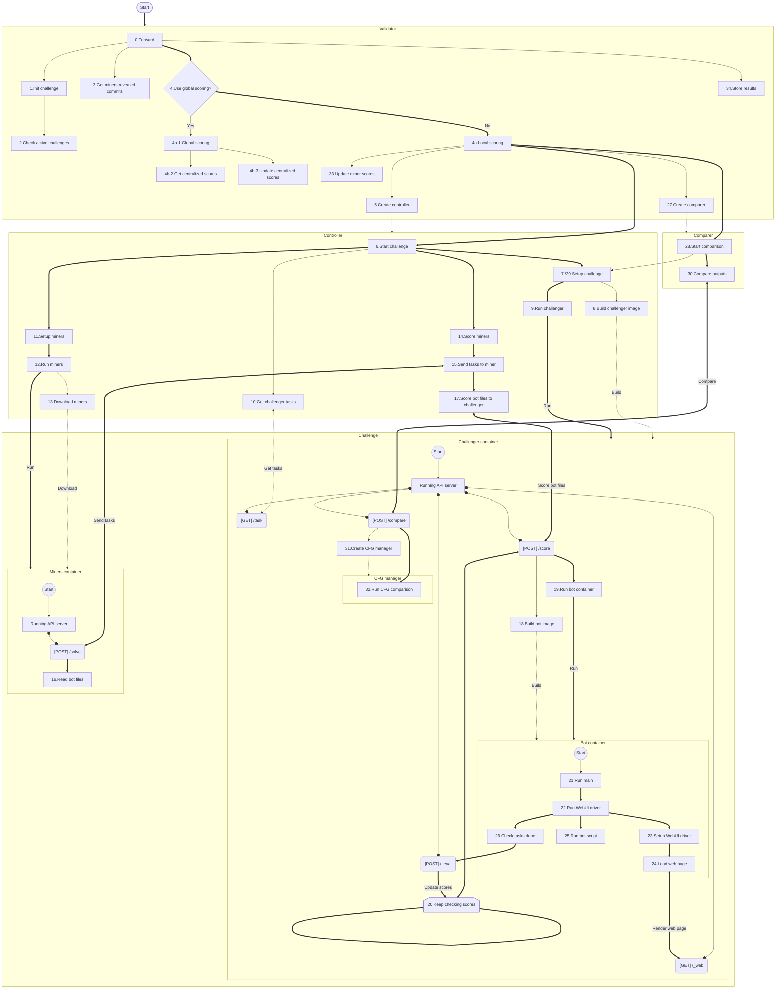

# Humanize behavior challenge (General)

```mermaid
flowchart TD
 subgraph validator["Validator"]
        vl_forward["0.Forward"]
        vl_init_challenge["1.Init challenge"]
        vl_check_active_challenges["2.Check active challenges"]
        vl_get_miners_revealed_commits["3.Get miners revealed commits"]
        vl_use_global_scoring{"4.Use global scoring?"}
        vl_local_scoring["4a.Local scoring"]
        vl_global_scoring["4b-1.Global scoring"]
        vl_get_centrailized_scores["4b-2.Get centralized scores"]
        vl_update_centrailized_scores["4b-3.Update centralized scores"]
        vl_create_controller["5.Create controller"]
        vl_create_comparer["27.Create comparer"]
        vl_update_miner_scores["33.Update miner scores"]
        vl_store_miner_results["34.Store results"]
  end
 subgraph controller["Controller"]
        start_challenge["6.Start challenge"]
        ct_setup_challenge["7./29.Setup challenge"]
        ct_build_challenger["8.Build challenger image"]
        ct_run_challenger["9.Run challenger"]
        ct_get_ch_tasks["10.Get challenger tasks"]
        ct_setup_miners["11.Setup miners"]
        ct_run_miners["12.Run miners"]
        ct_download_miners["13.Download miners"]
        ct_score_miners["14.Score miners"]
        ct_send_tasks_mi["15.Send tasks to miner"]
        ct_send_bot_files["17.Score bot files to challenger"]
  end
 subgraph comparer["Comparer"]
        start_comparison["28.Start comparison"]
        cm_compare_outputs["30.Compare outputs"]
  end
 subgraph cfg_manager["CFG manager"]
        run_cfg_comparison["32.Run CFG comparison"]
  end
 subgraph bot_container["Bot container"]
        start_bot_container(("Start"))
        bt_run_main["21.Run main"]
        bot_run_webui_driver["22.Run WebUI driver"]
        bot_setup_driver["23.Setup WebUI driver"]
        bot_load_web_page["24.Load web page"]
        bot_run_script["25.Run bot script"]
        bot_check_tasks_done["26.Check tasks done"]
  end
 subgraph challenger_container["Challenger container"]
        start_challenger(("Start"))
        ch_server["Running API server"]
        ch_task_endpoint["[GET] /task"]
        ch_score_endpoint["[POST] /score"]
        ch_web_endpoint["[GET] /_web"]
        ch_eval_endpoint["[POST] /_eval"]
        ch_compare_endpoint["[POST] /compare"]
        ch_build_bot_image["18.Build bot image"]
        ch_run_bot_container["19.Run bot container"]
        ch_checking_scores["20.Keep checking scores"]
        ch_create_cfg_manager["31.Create CFG manager"]
        cfg_manager
        bot_container
  end
 subgraph miners_container["Miners container"]
        start_miner_container(("Start"))
        mi_server["Running API server"]
        mi_solve_endpoint["[POST] /solve"]
        mi_read_bot_files["16.Read bot files"]
  end
 subgraph hb_challenge["Challenge"]
        challenger_container
        miners_container
  end
    start(["Start"]) ==> validator
    vl_forward --> vl_init_challenge & vl_get_miners_revealed_commits & vl_store_miner_results
    vl_forward ==> vl_use_global_scoring
    vl_init_challenge --> vl_check_active_challenges
    vl_use_global_scoring -- Yes --> vl_global_scoring
    vl_global_scoring --> vl_get_centrailized_scores & vl_update_centrailized_scores
    vl_use_global_scoring == No ==> vl_local_scoring
    vl_local_scoring ---> vl_create_controller
    vl_create_controller -.-> controller
    vl_local_scoring ==> start_challenge & start_comparison
    vl_local_scoring --> vl_create_comparer & vl_update_miner_scores
    vl_create_comparer -.-> comparer
    start_comparison --> ct_setup_challenge
    start_comparison ==> cm_compare_outputs
    start_challenge ==> ct_setup_challenge
    start_challenge --> ct_get_ch_tasks
    ct_setup_challenge --> ct_build_challenger
    ct_setup_challenge ==> ct_run_challenger
    start_challenge ====> ct_setup_miners & ct_score_miners
    ct_setup_miners ==> ct_run_miners
    ct_run_miners -.-> ct_download_miners
    ct_score_miners ==> ct_send_tasks_mi
    ct_send_tasks_mi ==> ct_send_bot_files
    ct_build_challenger -. Build .-> challenger_container
    ct_run_challenger == Run ==> challenger_container
    ct_download_miners -. Download .-> miners_container
    ct_run_miners == Run =======> miners_container
    ct_get_ch_tasks <-. Get tasks .-> ch_task_endpoint
    ct_send_tasks_mi <== Send tasks ==> mi_solve_endpoint
    ct_send_bot_files <== Score bot files =====> ch_score_endpoint
    cm_compare_outputs <== Compare ==> ch_compare_endpoint
    start_challenger --> ch_server
    ch_server o--o ch_task_endpoint & ch_web_endpoint & ch_eval_endpoint & ch_compare_endpoint
    ch_server o---o ch_score_endpoint
    ch_score_endpoint --> ch_build_bot_image
    ch_score_endpoint ==> ch_run_bot_container
    ch_score_endpoint <==> ch_checking_scores
    ch_checking_scores ==> ch_checking_scores
    ch_run_bot_container == Run =======> bot_container
    bot_load_web_page <== Render web page =====> ch_web_endpoint
    ch_build_bot_image -. Build .....-> bot_container
    bot_check_tasks_done ==> ch_eval_endpoint
    ch_eval_endpoint == Update scores ==> ch_checking_scores
    ch_compare_endpoint --> ch_create_cfg_manager
    ch_compare_endpoint ==> run_cfg_comparison
    ch_create_cfg_manager -.-> cfg_manager
    start_bot_container --> bt_run_main
    bt_run_main ==> bot_run_webui_driver
    bot_run_webui_driver ==> bot_setup_driver & bot_run_script & bot_check_tasks_done
    bot_setup_driver ==> bot_load_web_page
    start_miner_container --> mi_server
    mi_server o--o mi_solve_endpoint
    mi_solve_endpoint ==> mi_read_bot_files
    vl_forward@{ shape: rect}
    vl_init_challenge@{ shape: rect}
    vl_check_active_challenges@{ shape: rect}
    vl_get_miners_revealed_commits@{ shape: rect}
    vl_local_scoring@{ shape: rect}
    vl_global_scoring@{ shape: rect}
    vl_get_centrailized_scores@{ shape: rect}
    vl_update_centrailized_scores@{ shape: rect}
    vl_create_controller@{ shape: rect}
    vl_create_comparer@{ shape: rect}
    vl_update_miner_scores@{ shape: rect}
    vl_store_miner_results@{ shape: rect}
    start_challenge@{ shape: rect}
    ct_setup_challenge@{ shape: rect}
    ct_build_challenger@{ shape: rect}
    ct_run_challenger@{ shape: rect}
    ct_get_ch_tasks@{ shape: rect}
    ct_setup_miners@{ shape: rect}
    ct_run_miners@{ shape: rect}
    ct_download_miners@{ shape: rect}
    ct_score_miners@{ shape: rect}
    ct_send_tasks_mi@{ shape: rect}
    ct_send_bot_files@{ shape: rect}
    start_comparison@{ shape: rect}
    cm_compare_outputs@{ shape: rect}
    run_cfg_comparison@{ shape: rect}
    bt_run_main@{ shape: rect}
    bot_run_webui_driver@{ shape: rect}
    bot_setup_driver@{ shape: rect}
    bot_load_web_page@{ shape: rect}
    bot_run_script@{ shape: rect}
    bot_check_tasks_done@{ shape: rect}
    ch_server@{ shape: rect}
    ch_task_endpoint@{ shape: rounded}
    ch_score_endpoint@{ shape: rounded}
    ch_web_endpoint@{ shape: rounded}
    ch_eval_endpoint@{ shape: rounded}
    ch_compare_endpoint@{ shape: rounded}
    ch_build_bot_image@{ shape: rect}
    ch_run_bot_container@{ shape: rect}
    ch_checking_scores@{ shape: notch-pent}
    ch_create_cfg_manager@{ shape: rect}
    mi_server@{ shape: rect}
    mi_solve_endpoint@{ shape: rounded}
    mi_read_bot_files@{ shape: rect}

```
