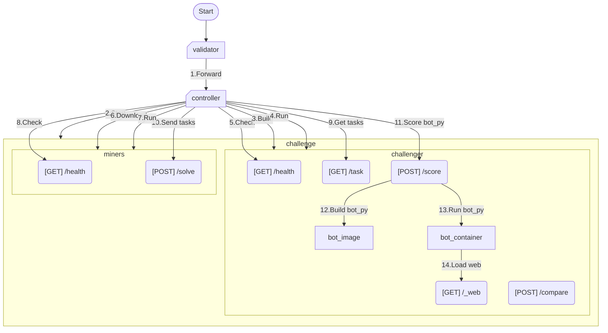

# Humanize behavior challenge (Small)

```mermaid
flowchart TD
    start@{ shape: stadium, label: "Start" }
    validator@{ shape: card, label: "validator" }
    controller@{ shape: card, label: "controller" }

    start --> validator
    validator -- 1.Forward --> controller
    controller -- 2.Start --> challenge
    controller -- 3.Build --> challenger
    controller -- 4.Run --> challenger
    controller -- 5.Check --> ch_health_endpoint
    controller -- 6.Download --> miners
    controller -- 7.Run --> miners
    controller -- 8.Check --> mi_health_endpoint
    controller -- 9.Get tasks --> ch_task_endpoint
    controller -- 10.Send tasks --> mi_solve_endpoint
    controller -- 11.Score bot_py --> ch_score_endpoint
    ch_score_endpoint -- 12.Build bot_py --> bot_image
    ch_score_endpoint -- 13.Run bot_py --> bot_container
    bot_container -- 14.Load web --> ch_web_endpoint

    subgraph challenge
    subgraph challenger
    bot_image@{ shape: rect, label: "bot_image" }
    bot_container@{ shape: rect, label: "bot_container" }

    ch_health_endpoint@{ shape: rounded, label: "[GET] /health" }
    ch_task_endpoint@{ shape: rounded, label: "[GET] /task" }
    ch_score_endpoint@{ shape: rounded, label: "[POST] /score" }
    ch_web_endpoint@{ shape: rounded, label: "[GET] /_web" }
    ch_compare_endpoint@{ shape: rounded, label: "[POST] /compare" }

    end

    subgraph miners
    mi_health_endpoint@{ shape: rounded, label: "[GET] /health" }
    mi_solve_endpoint@{ shape: rounded, label: "[POST] /solve" }
    end
    end
```
